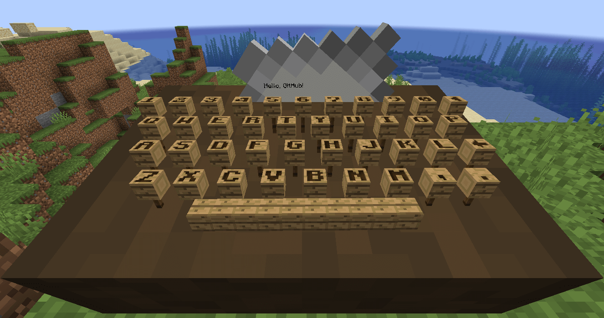

# Minecraft Typewriter
A Minecraft Paper plugin that tries to emulate a typewriter.
It uses display entities and tab completion to make this work in realtime.

## Features
The plugin reads keystrokes from tab completion,
and actually "pushes" the keys down in Minecraft.
It also pushes the paper up like an actual typewriter would.
You can also export the "letter" to a book.
The system is made up dynamically
to also support different keyboard layouts and keycap textures,
only one exists right now though (wood).

## Why?
I don't know, really.
It's just a hobby project of mine,
as I think typewriters are fascinating.
I think it's a nice project to work on my skills,
and have a little fun :).

## Demo
Click here for a (Dutch) short of mine showing the plugin.
[Click here](https://youtube.com/shorts/Awj9Y-SPQDU)